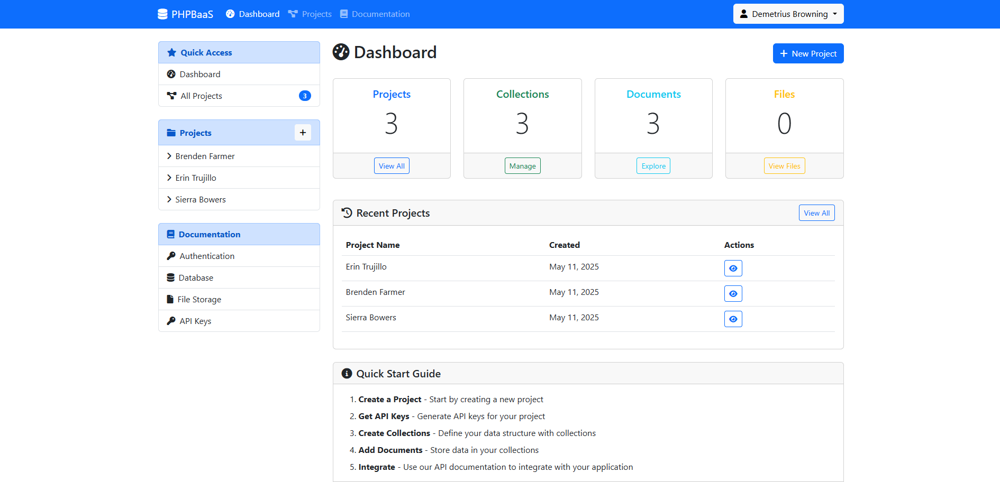

# PHPBaaS
PHPBaaS - PHP Backend as a Service

## Screenshots


## Description
This project is a web-based application designed to manage deployments, files, keys, projects, and more. It includes a dashboard for administrative tasks, an API for programmatic access, and a storage system for managing files. Developers who requird quick backend free and open source, instead of vender locking and paid service. No Docker, No ORM, Just Pure PHP and Raw MYSQL makes developers life easier. If you don't want to setup then use our service free with rate limit.

## Features
- **Dashboard**: Manage deployments, files, keys, projects, and user settings.
- **API**: Provides endpoints for authentication, caching, database operations, and more.
- **Storage**: Organizes and stores files in a structured manner.
- **Documentation**: Comprehensive documentation for all modules and APIs.

## Directory Structure
```
- api/: Contains API endpoints for various functionalities.
- assets/: Includes CSS, JavaScript, and image files.
- config/: Configuration files for the application.
- dashboard/: Frontend files for the admin dashboard.
- documentation/: Documentation for the project.
- includes/: Commonly used scripts and middleware.
- storage/: File storage organized by folders.
```

## Installation
1. Clone the repository to your local machine.
2. Configure the MySQL database in `config/config.php`.

## Contribution
We welcome contributions to this project! To contribute, please follow these steps:

1. **Fork the Repository**: Click the "Fork" button at the top of this repository.
2. **Clone Your Fork**: Clone your forked repository to your local machine.
    ```bash
    git clone https://github.com/your-username/your-forked-repo.git
    ```
3. **Create a Branch**: Create a new branch for your feature or bug fix.
    ```bash
    git checkout -b feature-or-bugfix-name
    ```
4. **Make Changes**: Implement your changes and commit them with clear and concise commit messages.
    ```bash
    git commit -m "Description of changes"
    ```
5. **Push Changes**: Push your changes to your forked repository.
    ```bash
    git push origin feature-or-bugfix-name
    ```
6. **Submit a Pull Request**: Open a pull request to the main repository. Provide a detailed description of your changes and the problem they solve.

### Guidelines
- Ensure your code follows the project's coding standards.
- Write clear and concise commit messages.
- Test your changes thoroughly before submitting.
- Include documentation updates if your changes affect the documentation.

Thank you for contributing!

## Author
Krunal Kanojiya & TechAlgoSpotlight

## License
This project is licensed under the GNU General Public License v3.0. See the LICENSE file for details.
